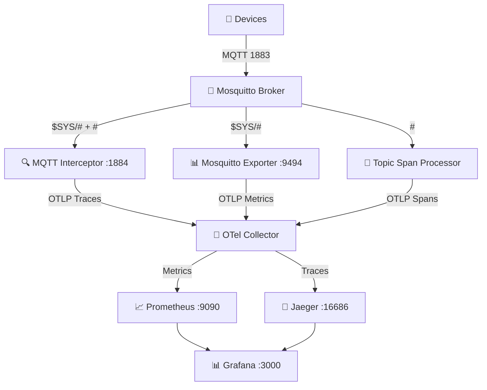
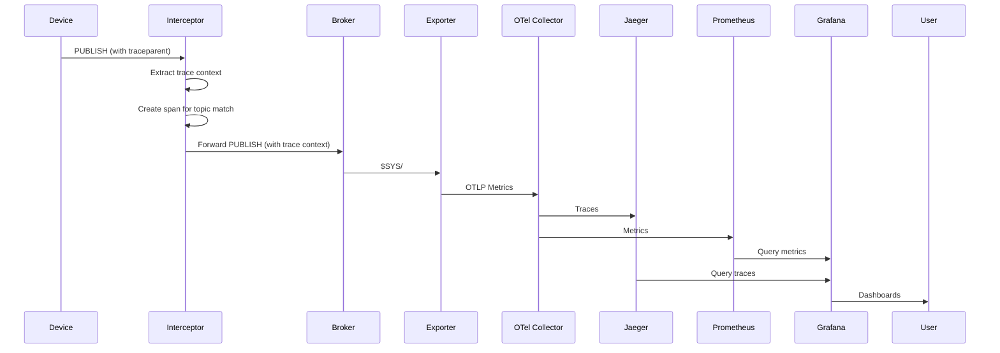

# MQTT Observability with OpenTelemetry

A complete observability stack for MQTT-based IoT systems.

## Quick Start

```bash
# Clone and start the demo stack
cd docker
docker compose up -d

# Verify services
docker compose ps

# Access dashboards
open http://localhost:3000  # Grafana (admin/admin)
open http://localhost:16686 # Jaeger
```

## Architecture



## Components

### 1. MQTT Interceptor (`mqtt-interceptor/`)
- **Port**: 1884 (proxies to 1883)
- **Function**: Intercepts MQTT messages, extracts/injects W3C Trace Context
- **Features**: Topic-based span creation, configurable sampling, OTLP export

### 2. Mosquitto Exporter (`mosquitto-exporter/`)
- **Port**: 9494 (Prometheus), OTLP to collector
- **Function**: Scrapes `$SYS/#` topics, exports broker metrics
- **Metrics**: 40+ metrics covering clients, messages, bytes, subscriptions

### 3. Topic Span Processor (`topic-span-processor/`)
- Creates spans based on MQTT topic patterns
- Extracts attributes from topic segments
- Correlates parent/child spans via trace context

### 4. Grafana Dashboards (`grafana-dashboards/`)
| Dashboard | Description |
|-----------|-------------|
| MQTT Broker Overview | Connections, message rates, throughput |
| MQTT Distributed Tracing | Latency, errors, trace visualization |
| MQTT Topic Analysis | Per-topic metrics, patterns |

### 5. Docker Compose Stack (`docker/`)
Complete demo environment with:
- Mosquitto broker
- MQTT Interceptor
- Mosquitto Exporter
- OTEL Collector
- Prometheus
- Grafana
- Jaeger
- Test publisher

## Data Flow



## Configuration

All components configure via environment variables or YAML config files. See component docs:

- [MQTT Interceptor](docs/mqtt-interceptor.md)
- [Mosquitto Exporter](docs/mosquitto-exporter.md)
- [Docker Compose](docs/docker-compose.md)
- [Grafana Dashboards](docs/grafana-dashboards.md)

## Trace Context Propagation

### MQTT v5 (User Properties)
```python
# Inject trace context
props = mqtt.Properties(PacketTypes.PUBLISH)
props.UserProperty = [
    ("traceparent", "00-0af7651916cd43dd8448eb211c80319c-b7ad6b7169203331-01"),
    ("tracestate", "congo=t61rcWkgMzE")
]
client.publish("devices/sensor-001/telemetry", payload, properties=props)

# Extract trace context
for k, v in msg.properties.UserProperty:
    if k == "traceparent":
        traceparent = v
```

### MQTT v3.1.1 (Topic-based)
Uses topic pattern `trace/<trace_id>/<span_id>` for correlation.

## Example: Publishing with Traces

```bash
# With trace context (MQTT v5)
mosquitto_pub -h localhost -p 1884 \
  -t 'devices/sensor-001/telemetry' \
  -m '{"temperature": 23.5}' \
  -q 1 -V 5 \
  -D '{"traceparent": "00-0af7651916cd43dd8448eb211c80319c-b7ad6b7169203331-01"}'

# View traces in Jaeger
open http://localhost:16686
```

## Developing

```bash
# Install dependencies
pip install -e mqtt-interceptor[dev]
pip install -e mosquitto-exporter[dev]

# Run tests
pytest mqtt-interceptor/tests/
pytest mosquitto-exporter/tests/

# Lint
ruff check mqtt-interceptor/ mosquitto-exporter/
mypy mqtt-interceptor/src/ mosquitto-exporter/src/
```

## Deploying to Production

### Kubernetes (Helm)
```bash
# Coming soon: Helm charts for each component
helm install mqtt-obs ./helm/chart
```

### Key Production Considerations
1. **TLS**: Enable TLS for all MQTT and OTLP connections
2. **Authentication**: Configure username/password or certificates
3. **Resource Limits**: Set CPU/memory limits for containers
4. **Persistence**: Use persistent volumes for Prometheus/Grafana/Jaeger
5. **Sampling**: Adjust trace sampling rate (default 10%) based on volume
6. **Retention**: Configure Prometheus/Jaeger retention policies

## License

MIT License - see [LICENSE](LICENSE)