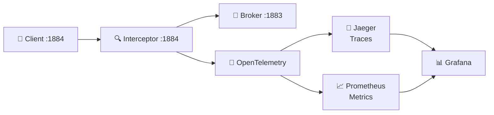

# MQTT Interceptor Configuration

## Overview

The MQTT Interceptor is a proxy that sits between MQTT clients and the broker, intercepting messages to propagate W3C Trace Context for distributed tracing.

## Configuration

### Environment Variables

| Variable | Default | Description |
|----------|---------|-------------|
| `MQTT_LISTEN_HOST` | `0.0.0.0` | Host to listen on for incoming client connections |
| `MQTT_LISTEN_PORT` | `1884` | Port to listen on for incoming client connections |
| `MQTT_UPSTREAM_HOST` | `mosquitto` | Upstream broker hostname |
| `MQTT_UPSTREAM_PORT` | `1883` | Upstream broker port |
| `MQTT_VERSION` | `5` | MQTT protocol version (3 or 5) |
| `MQTT_CLIENT_ID` | `mqtt-interceptor` | Client ID for upstream connection |
| `MQTT_USERNAME` | - | Username for authentication (optional) |
| `MQTT_PASSWORD` | - | Password for authentication (optional) |
| `MQTT_KEEPALIVE` | `60` | Keepalive interval in seconds |
| `MQTT_CLEAN_START` | `true` | Clean session flag |

### Trace Configuration

| Variable | Default | Description |
|----------|---------|-------------|
| `TRACE_PROPAGATOR` | `w3c` | Trace context propagator: `w3c`, `baggage`, or `mqtt-topic` |
| `TRACE_TOPIC_PATTERNS` | `devices/+/telemetry,devices/+/commands` | Comma-separated topic patterns for span creation |
| `TRACE_SAMPLE_RATE` | `0.1` | Sampling rate (0.0 - 1.0) |
| `TRACE_PROPAGATE_ON_PUBLISH` | `true` | Inject trace context on outgoing PUBLISH |
| `TRACE_PROPAGATE_ON_SUBSCRIBE` | `true` | Inject trace context on outgoing SUBSCRIBE |

### OpenTelemetry Configuration

| Variable | Default | Description |
|----------|---------|-------------|
| `OTEL_EXPORTER_OTLP_ENDPOINT` | `http://otelcol:4317` | OTLP gRPC endpoint |
| `OTEL_SERVICE_NAME` | `mqtt-interceptor` | Service name for telemetry |
| `OTEL_SERVICE_VERSION` | `0.1.0` | Service version |
| `OTEL_RESOURCE_ATTRIBUTES` | - | Comma-separated key=value pairs |
| `OTEL_EXPORTER_OTLP_INSECURE` | `true` | Use insecure connection |
| `OTEL_EXPORTER_OTLP_TIMEOUT` | `10` | Export timeout in seconds |

### Metrics Configuration

| Variable | Default | Description |
|----------|---------|-------------|
| `METRICS_ENABLED` | `true` | Enable Prometheus metrics |
| `METRICS_PORT` | `9464` | Prometheus metrics port |
| `METRICS_PATH` | `/metrics` | Metrics endpoint path |

### Logging Configuration

| Variable | Default | Description |
|----------|---------|-------------|
| `LOG_LEVEL` | `INFO` | Log level: DEBUG, INFO, WARNING, ERROR |
| `LOG_FORMAT` | `json` | Log format: `json` or `console` |

## Trace Context Propagation

### MQTT v5 (User Properties)

When using MQTT v5, trace context is propagated via **User Properties** in the MQTT packet:

```
UserProperty: traceparent=00-0af7651916cd43dd8448eb211c80319c-b7ad6b7169203331-01
UserProperty: tracestate=vendor=value
```

### MQTT v3.1.1 (Topic-based)

When using MQTT v3.1.1, trace context is encoded in a special topic prefix:

```
Original topic: devices/sensor-001/telemetry
Traced topic:   trace/00-0af7651916cd43dd8448eb211c80319c-b7ad6b7169203331-01/devices/sensor-001/telemetry
```

### W3C Trace Context Format

The `traceparent` header follows the [W3C Trace Context](https://www.w3.org/TR/trace-context/) specification:

```
version-trace-id-parent-id-flags
```

Example: `00-0af7651916cd43dd8448eb211c80319c-b7ad6b7169203331-01`

- `version`: 2 hex digits (currently `00`)
- `trace-id`: 32 hex digits (16 bytes)
- `parent-id`: 16 hex digits (8 bytes)
- `flags`: 2 hex digits (sampling flag = bit 1)

## Span Creation

Spans are automatically created for messages matching `TRACE_TOPIC_PATTERNS`:

- **Direction**: `publish` (outgoing) or `subscribe` (incoming)
- **Span Name**: `mqtt.{direction}.{topic_pattern}`
- **Span Kind**: `PRODUCER` for publish, `CONSUMER` for subscribe
- **Attributes**:
  - `mqtt.topic` - Full topic string
  - `mqtt.topic_pattern` - Matched pattern
  - `mqtt.qos` - QoS level (0, 1, 2)
  - `mqtt.retain` - Retain flag (true/false)
  - `mqtt.topic_segment_{N}` - Extracted wildcard values
  - `mqtt.topic_suffix_{N}` - Remaining topic after `#` wildcard

## Metrics

| Metric | Type | Labels | Description |
|--------|------|--------|-------------|
| `mqtt_interceptor_messages_intercepted_total` | Counter | direction, topic_pattern | Total messages intercepted |
| `mqtt_interceptor_spans_created_total` | Counter | topic_pattern, span_kind | Total spans created |
| `mqtt_interceptor_trace_context_extracted_total` | Counter | propagator, success | Trace context extraction attempts |
| `mqtt_interceptor_trace_context_injected_total` | Counter | propagator | Trace context injection count |
| `mqtt_interceptor_intercept_latency_seconds` | Histogram | direction | Intercept processing latency |

## Example Usage

### Docker Compose

```yaml
services:
  mqtt-interceptor:
    image: mqtt-interceptor:latest
    ports:
      - "1884:1884"
      - "9464:9464"
    environment:
      - MQTT_UPSTREAM_HOST=mosquitto
      - TRACE_TOPIC_PATTERNS=devices/+/telemetry,vehicles/+/telemetry
      - TRACE_SAMPLE_RATE=0.1
      - OTEL_EXPORTER_OTLP_ENDPOINT=http://otelcol:4317
```

### Publishing with Trace Context (Python)

```python
import paho.mqtt.client as mqtt

client = mqtt.Client(mqtt.CallbackAPIVersion.VERSION2, protocol=mqtt.MQTTv5)

# Add trace context as user properties
props = mqtt.Properties(mqtt.PacketTypes.PUBLISH)
props.UserProperty = [
    ("traceparent", "00-0af7651916cd43dd8448eb211c80319c-b7ad6b7169203331-01"),
    ("tracestate", "vendor=example")
]

client.publish("devices/sensor-001/telemetry", '{"temp": 23.5}', qos=1, properties=props)
```

### Subscribing and Extracting Context

```python
def on_message(client, userdata, msg):
    # Extract from user properties (MQTT v5)
    traceparent = None
    tracestate = None
    if msg.properties and msg.properties.UserProperty:
        for k, v in msg.properties.UserProperty:
            if k == "traceparent":
                traceparent = v
            elif k == "tracestate":
                tracestate = v
    
    # Use trace context for correlation
    if traceparent:
        print(f"Trace: {traceparent}")
```

## Testing

```bash
# Start the stack
docker compose -f docker/docker-compose.yml up -d

# Publish test messages with trace context
mosquitto_pub -h localhost -p 1884 \
  -t 'devices/sensor-001/telemetry' \
  -m '{"temperature": 23.5}' \
  -q 1 \
  -V 5 \
  -D '{"traceparent": "00-0af7651916cd43dd8448eb211c80319c-b7ad6b7169203331-01"}'

# View metrics
curl http://localhost:9464/metrics

# View traces in Jaeger
open http://localhost:16686
```

## Architecture



**Interceptor flow:**
1. Accepts connections on port 1884
2. Forwards to upstream broker on 1883
3. Extracts trace context from incoming messages
4. Creates spans for matching topic patterns
5. Injects trace context into forwarded messages
6. Exports spans via OTLP to collector